# ⚽ RETESP 4L - Sistema de Gestão Esportiva

[](https://github.com/wil-ckaew/retesp-4linhas)
[](LICENSE)
[](https://www.rust-lang.org/)
[](https://reactjs.org/)
[](https://nextjs.org/)
[](https://reactnative.dev/)
[](https://www.docker.com/)

Sistema completo para gestão de escolinhas de futebol, com painel administrativo web e aplicativo mobile.

## 📋 Índice

- [Sobre o Projeto](#-sobre-o-projeto)
- [🎯 Funcionalidades](#-funcionalidades)
- [🚀 Tecnologias](#-tecnologias)
- [🏗️ Arquitetura](#️-arquitetura)
- [📸 Screenshots](#-screenshots)
- [🔧 Instalação](#-instalação)
- [📱 Aplicativo Mobile](#-aplicativo-mobile)
- [🔗 Endpoints da API](#-endpoints-da-api)
- [🤝 Contribuição](#-contribuição)
- [📄 Licença](#-licença)
- [📞 Contato](#-contato)

## 📋 Sobre o Projeto

O **RETESP 4L** é um sistema completo de gestão esportiva desenvolvido para gerenciar atletas, treinos, presenças e conteúdo social de uma equipe esportiva. O projeto conta com uma arquitetura moderna e escalável, utilizando as melhores práticas de desenvolvimento.

### 📱 Interfaces

| Web App | Mobile App |
|---------|------------|
| Painel administrativo completo | Aplicativo para atletas e pais |
| Dashboard com gráficos | Acompanhamento de presenças |
| Gestão de atletas e treinos | Feed social e stories |
| Relatórios e estatísticas | Notificações em tempo real |

## 🎯 Funcionalidades

### ✅ Módulos do Sistema

- 📊 **Dashboard** - Gráficos e estatísticas em tempo real
- 👥 **Gestão de Atletas** - CRUD completo com fotos e documentos
- 🏋️ **Gestão de Treinos** - Criação e acompanhamento
- 🏫 **Gestão de Turmas** - Organização por categorias (Sub-10 a Sub-20)
- 👨‍🏫 **Gestão de Professores** - Cadastro e especialização
- ✅ **Chamada** - Registro de presença diária com histórico
- 📸 **Mídias** - Upload de fotos e vídeos
- 📱 **Rede Social** - Feed com posts e compartilhamento
- 🤖 **IA** - Sugestão de treinos personalizados
- 📝 **Stories** - Compartilhamento de momentos

## 🚀 Tecnologias

### Backend
- 🦀 **Rust** + Actix Web
- 🐘 **PostgreSQL** - Banco de dados
- 🔴 **Redis** - Cache e filas
- 🎯 **Ollama** - IA para treinos personalizados
- 🐳 **Docker** - Containerização

### Frontend Web
- ⚛️ **Next.js 14** + React
- 🎨 **Tailwind CSS** - Estilização
- 📊 **Recharts** - Gráficos interativos
- 🔷 **TypeScript** - Tipagem estática
- 📱 **Responsivo** - Design adaptável

### Mobile
- 📱 **React Native** + Expo
- 🎨 **React Navigation** - Navegação
- 📊 **React Native Chart Kit** - Gráficos
- 🔷 **TypeScript** - Tipagem estática
- 📷 **Expo Image Picker** - Upload de imagens

### Infraestrutura
- 🐳 **Docker** & **Docker Compose**
- 🔄 **GitHub Actions** - CI/CD
- ☁️ **Cloud Ready** - Pronto para deploy

## 🏗️ Arquitetura

retesp-4linhas/
├── backend/ # API em Rust
│ ├── src/
│ │ ├── main.rs
│ │ ├── models/
│ │ ├── routes/
│ │ └── services/
│ ├── Dockerfile
│ └── Cargo.toml
│
├── frontend/ # Next.js Web
│ ├── src/
│ │ ├── app/
│ │ ├── components/
│ │ └── lib/
│ ├── public/
│ │ └── images/
│ ├── Dockerfile
│ └── package.json
│
├── mobile/ # React Native App
│ ├── src/
│ │ ├── screens/
│ │ ├── components/
│ │ ├── services/
│ │ └── context/
│ ├── app.json
│ └── package.json
│
├── ai_service/ # Serviço de IA
├── coin_engine/ # Motor de recompensas
├── notification_worker/ # Worker de notificações
├── reports_service/ # Serviço de relatórios
├── social_service/ # Serviço de rede social
├── video_ai/ # Processamento de vídeos
│
├── docker-compose.yml
├── .env.example
└── README.md
text


## 📸 Screenshots

### 🏠 Dashboard Principal
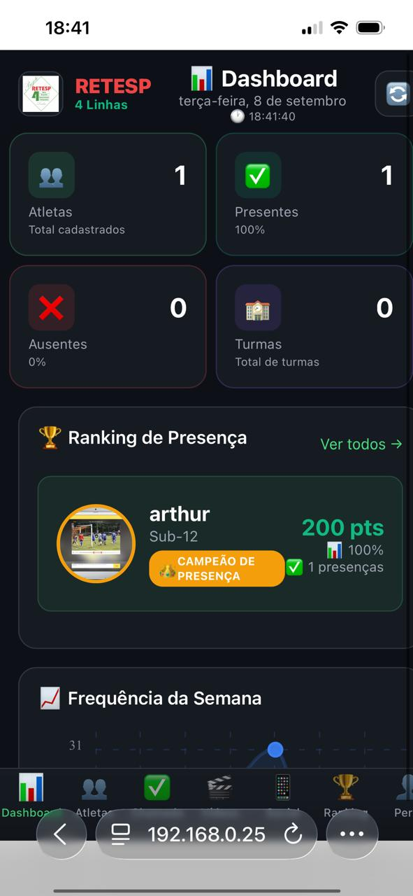

### 👥 Gestão de Atletas
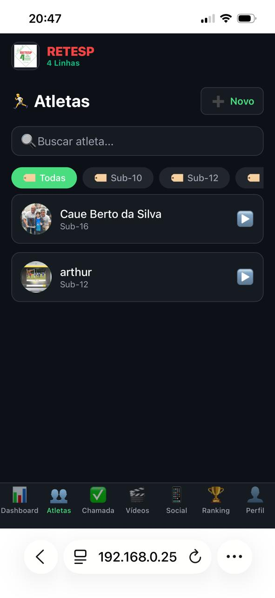

### ✅ Controle de Presença
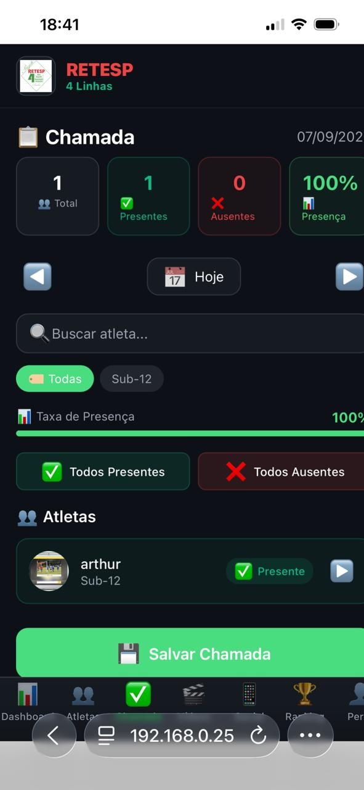

### 📱 Rede Social
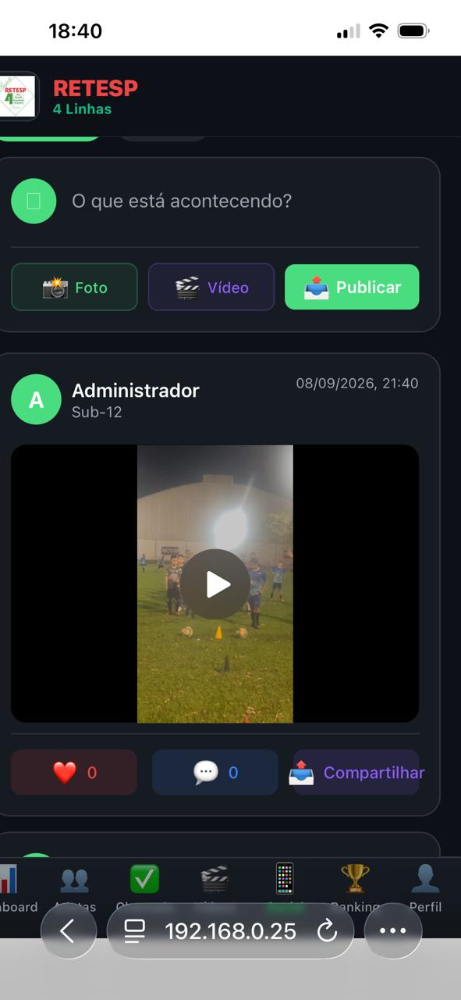

### 🏆 Ranking
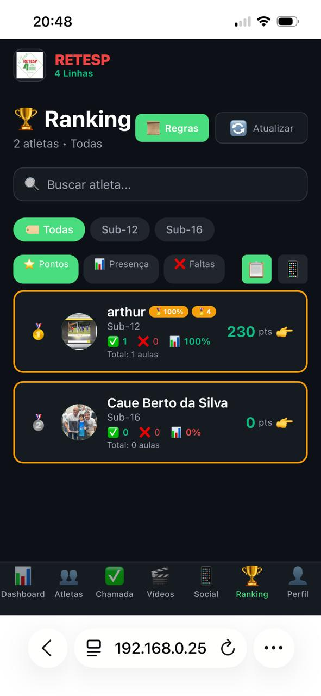

### 🎬 Vídeos
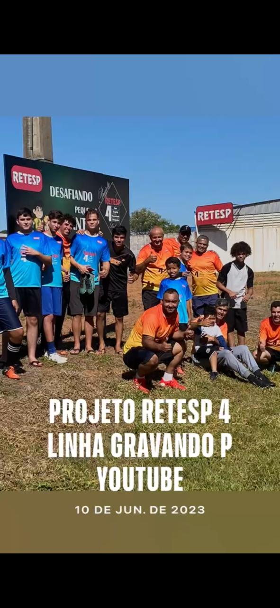

### 📸 Reels
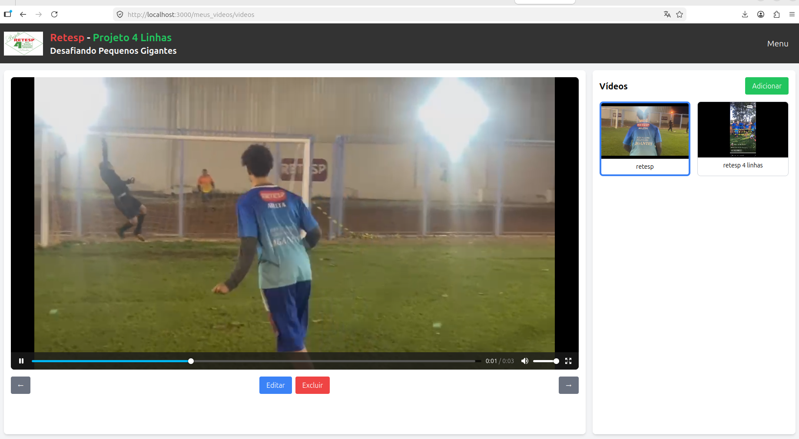

### 🏅 Conquistas
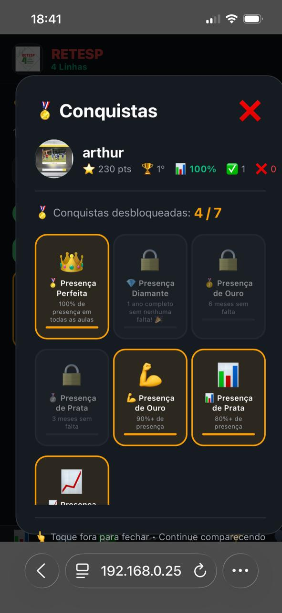

### 📊 Estatísticas
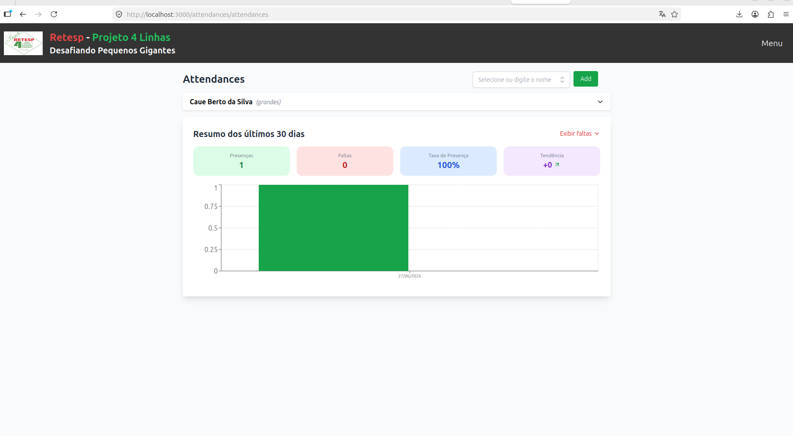

### 🏠 Tela Inicial
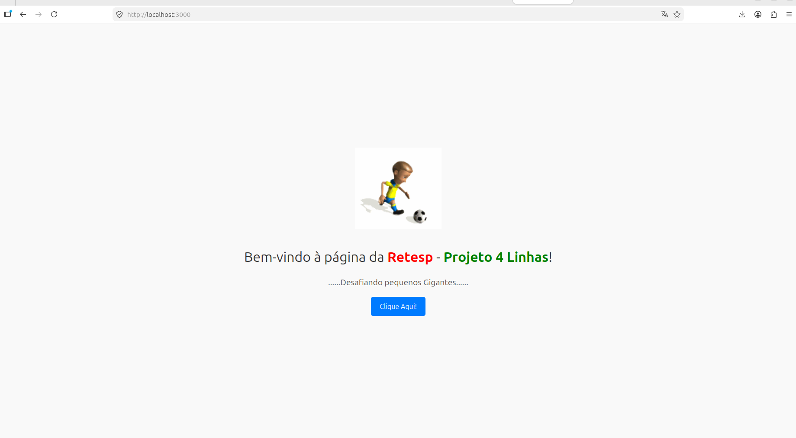

### ⚽ Esporte em Ação


### 🎨 Logos
<div align="center">
  
  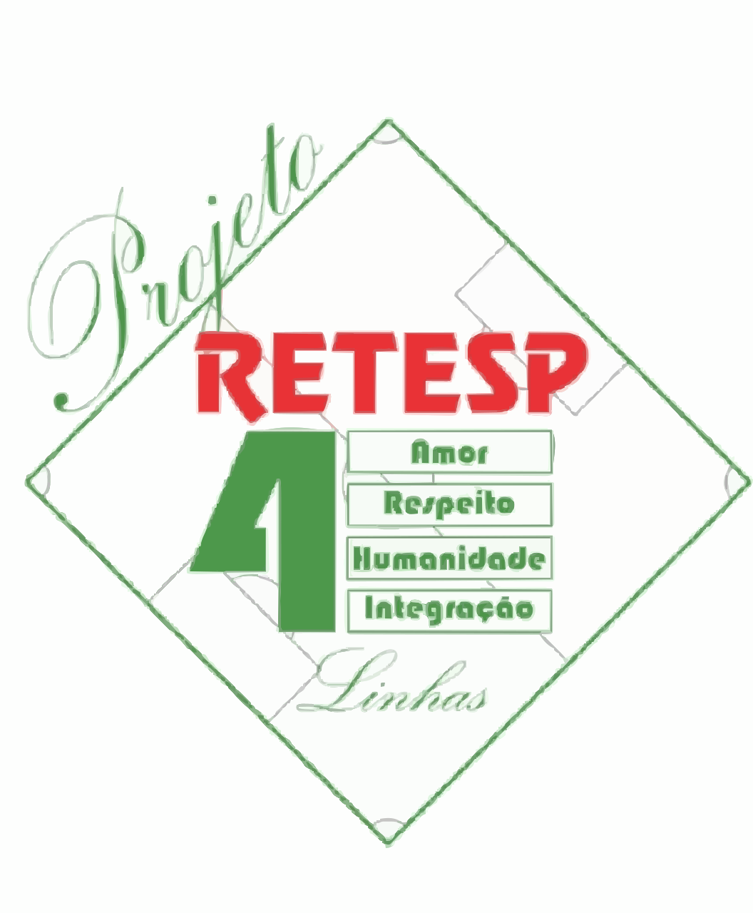
  
</div>

## 🔧 Instalação

### Pré-requisitos
- 🐳 Docker & Docker Compose
- 📦 Node.js 20+
- 🦀 Rust (para desenvolvimento)
- 📱 Expo CLI (para mobile)

### 🐳 Rodando com Docker (Recomendado)

```bash
# 1. Clonar o repositório
git clone https://github.com/wil-ckaew/retesp-4linhas.git
cd retesp-4linhas

# 2. Configurar variáveis de ambiente
cp backend/.env.example backend/.env
cp frontend/.env.example frontend/.env.local
cp mobile/.env.example mobile/.env

# 3. Subir todos os serviços
docker-compose up -d --build

# 4. Verificar logs
docker-compose logs -f

# 5. Acessar
# Web: http://localhost:3000
# API: http://localhost:8081

# 6. Parar todos os serviços
docker-compose down

💻 Desenvolvimento Local
Frontend
bash

cd frontend
npm install
npm run dev
# Acessar: http://localhost:3000

Backend
bash

cd backend
cargo build
cargo run
# API: http://localhost:8081

Mobile
bash

cd mobile
npm install
npx expo start
# Escanear QR Code com Expo Go

📱 Aplicativo Mobile
Instalação no Dispositivo
bash

cd mobile
npm install
npx expo start

# Opções:
# - Escanear QR Code com Expo Go (Android/iOS)
# - Pressionar 'a' para Android
# - Pressionar 'i' para iOS
# - Pressionar 'w' para Web

Configuração do .env
bash

# mobile/.env
API_URL=http://192.168.0.25:8081  # Seu IP local

🔗 Endpoints da API
Atletas
http

GET    /athletes          - Listar atletas
POST   /athletes          - Criar atleta
GET    /athletes/:id      - Buscar atleta
PUT    /athletes/:id      - Atualizar atleta
DELETE /athletes/:id      - Excluir atleta

Treinos
http

GET    /trainings         - Listar treinos
POST   /trainings         - Criar treino
GET    /trainings/:id     - Buscar treino
PUT    /trainings/:id     - Atualizar treino
DELETE /trainings/:id     - Excluir treino

Social
http

GET    /social/feed       - Feed social
POST   /social/posts      - Criar post
POST   /social/like/:id   - Curtir post
POST   /social/comment    - Comentar

Presença
http

GET    /attendance/today  - Presença de hoje
POST   /attendance        - Registrar presença
GET    /attendance/athlete/:id - Histórico do atleta

Mídias
http

POST   /upload            - Upload de arquivos
GET    /media/videos      - Listar vídeos
DELETE /media/:id         - Excluir mídia

🗄️ Banco de Dados
Principais Tabelas
sql

athletes          -- Atletas
attendance        -- Presenças
teams             -- Equipes/Turmas
coaches           -- Técnicos
trainings         -- Treinos
social_posts      -- Posts da rede social
stories           -- Stories
media             -- Mídias (fotos/vídeos)

🤝 Contribuição

    🍴 Faça um fork do projeto

    🌿 Crie sua branch (git checkout -b feature/AmazingFeature)

    💻 Commit suas mudanças (git commit -m 'Add some AmazingFeature')

    📤 Push para a branch (git push origin feature/AmazingFeature)

    🔃 Abra um Pull Request

Padrões de Commit
Tipo	Descrição	Exemplo
✨ feat	Nova funcionalidade	feat: Adicionar upload de vídeos
🐛 fix	Correção de bug	fix: Corrigir modal de comentários
📝 docs	Documentação	docs: Atualizar README
🎨 style	Estilização	style: Melhorar layout do dashboard
♻️ refactor	Refatoração	refactor: Otimizar queries SQL
🧪 test	Testes	test: Adicionar testes unitários
🔧 chore	Tarefas	chore: Atualizar dependências
📄 Licença

Este projeto está sob a licença MIT - veja o arquivo LICENSE para mais detalhes.
📞 Contato

    Desenvolvedor: Wil Ckaew

    Email: seu-email@example.com

    GitHub: wil-ckaew

    Site: retesp-4linhas.com

🙏 Agradecimentos

    A todos os colaboradores

    À comunidade open source

    Aos usuários que testam e contribuem

🎯 Roadmap
🔜 Versão 1.1.0

    □

    Sistema de notificações push
    □

    Relatórios avançados (PDF)
    □

    Integração com Google Calendar
    □

    Sistema de mensagens entre atletas
    □

    Exportação de dados

🔮 Versão 2.0.0

    □

    IA para recomendações de treino
    □

    Análise de desempenho com IA
    □

    Streaming de vídeos ao vivo
    □

    E-commerce para produtos da equipe
    □

    Integração com wearables